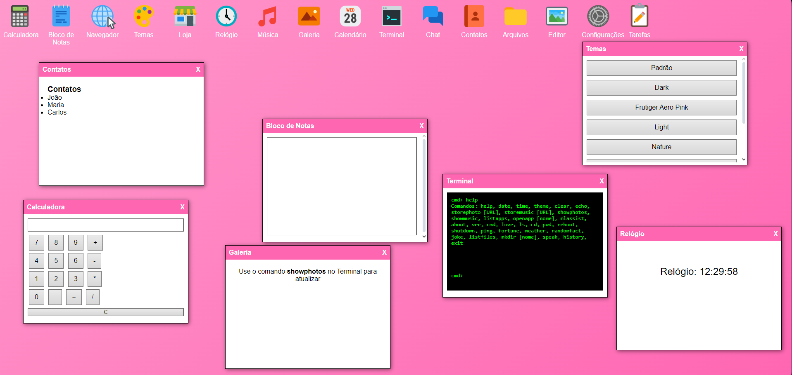

# 🌟 Sistema Operacional Simulado em HTML - Versão Robustificada 3.0 🌟

## 🖥️ Descrição
Este projeto simula um sistema operacional diretamente no navegador utilizando **HTML**, **CSS** e **JavaScript**. A interface rica e interativa oferece aplicativos, temas customizáveis, jogos, um terminal funcional e mais! É ideal para demonstrar habilidades em desenvolvimento web e explorar conceitos interativos.
## 🖼️ Captura de Tela

### Tela Inicial


---

## 📋 Funcionalidades
- ✅ **Aplicativos**: Calculadora, Bloco de Notas, Navegador, Loja de Apps, Terminal, Jogos, Galeria, Configurações e mais.
- ✅ **Jogos**: Snake, Tic Tac Toe, Rock-Paper-Scissors com IA e Adivinhe o Número.
- ✅ **Terminal Funcional**: Comandos como `help`, `storephoto [URL]`, `showphotos`, `openapp [appName]`, entre outros.
- ✅ **Temas Customizáveis**: Escolha entre temas como "Dark", "Ocean", "Vintage" e "Neon".
- ✅ **Loja Virtual**: Baixe novos aplicativos diretamente na interface.
- ✅ **Gerenciamento de Arquivos Virtuais**: Salve fotos, músicas e organize arquivos em pastas simuladas.
- ✅ **Chatbot Simples**: Converse diretamente no aplicativo de chat.
- ✅ **Integração com ML5.js**: Potencial para incorporar modelos de aprendizado de máquina.

---

## 🚀 Demonstração
Acesse o projeto diretamente no GitHub Pages:  
[https://yasminhtml1.github.io/meu-sistema-operacional/](https://yasminhtml1.github.io/meu-sistema-operacional/)

---

## 🛠️ Tecnologias Utilizadas
- **HTML5**: Para a estrutura do projeto.
- **CSS3**: Incluindo variáveis de tema e estilos responsivos.
- **JavaScript**: Para funcionalidades interativas, gerenciamento de janelas e lógica dos aplicativos.
- **ml5.js**: Integração para aprendizado de máquina (potencial futuro).

---

## 🌈 Temas Disponíveis
Os seguintes temas estão disponíveis no sistema:
1. **Padrão**:
   - Fundo: Imagem desfocada.
   - Cabeçalho: Azul com texto branco.
2. **Dark**:
   - Fundo: Preto e cinza escuro.
   - Cabeçalho: Cinza médio com texto branco.
3. **Frutiger Aero Pink**:
   - Fundo: Gradiente rosa.
   - Cabeçalho: Rosa escuro com texto branco.
4. **Light**:
   - Fundo: Branco com cinza claro.
   - Cabeçalho: Cinza claro com texto preto.
5. **Nature**:
   - Fundo: Paisagem de natureza.
   - Cabeçalho: Verde com texto branco.
6. **Neon**:
   - Fundo: Preto com detalhes neon verde.
   - Cabeçalho: Verde neon com texto preto.
7. **Ocean**:
   - Fundo: Imagem temática de oceano.
   - Cabeçalho: Azul oceano com texto branco.
8. **Vintage**:
   - Fundo: Imagem em escala de cinza.
   - Cabeçalho: Marrom escuro com texto branco.

### **Como usar os temas:**
- Abra o aplicativo **Temas** no sistema operacional simulado.
- Clique no botão correspondente ao tema desejado.

---

## 📜 Comandos Disponíveis no Terminal
Aqui estão os comandos que você pode usar no terminal do sistema:

### **Básicos**
- `help`: Exibe a lista de comandos disponíveis.
- `clear`: Limpa o terminal.
- `date`: Mostra a data atual.
- `time`: Mostra o horário atual.
- `echo [texto]`: Repete o texto inserido.

### **Gerenciamento de Arquivos**
- `storephoto [URL]`: Salva uma foto no sistema a partir de uma URL.
- `showphotos`: Mostra as fotos armazenadas.
- `storemusic [URL]`: Salva uma música no sistema a partir de uma URL.
- `showmusic`: Mostra as músicas armazenadas.
- `listfiles`: Lista os arquivos virtuais no diretório atual.
- `mkdir [nome_da_pasta]`: Cria uma pasta virtual.

### **Aplicativos**
- `listapps`: Lista todos os aplicativos disponíveis no sistema.
- `openapp [nome]`: Abre o aplicativo especificado pelo nome.

### **Outros**
- `theme`: Lista os temas disponíveis.
- `fortune`: Exibe uma mensagem inspiradora.
- `love`: Exibe uma mensagem motivacional.
- `reboot`: Simula a reinicialização do sistema.
- `shutdown`: Simula o desligamento do sistema.
- `ping`: Retorna "Pong!".
- `randomfact`: Mostra um fato aleatório.
- `joke`: Conta uma piada.

---

## 🧰 Como Usar
1. Clone o repositório:
   ```bash
   git clone https://github.com/YasminHtml1/meu-sistema-operacional.git
📝 Licença
Este projeto está sob a licença MIT. Você é livre para usá-lo e modificá-lo como quiser.
